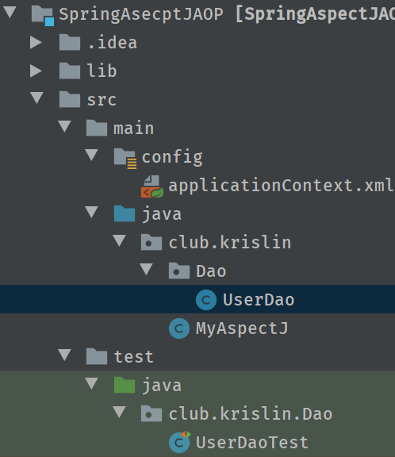

# Spring学习笔记(10)Spring的AspectJ的AOP

<!-- TOC -->

- [Spring学习笔记(10)Spring的AspectJ的AOP](#spring%e5%ad%a6%e4%b9%a0%e7%ac%94%e8%ae%b010spring%e7%9a%84aspectj%e7%9a%84aop)
- [在Spring中使用AspectJ实现AOP](#%e5%9c%a8spring%e4%b8%ad%e4%bd%bf%e7%94%a8aspectj%e5%ae%9e%e7%8e%b0aop)
  - [AspectJ 表达式](#aspectj-%e8%a1%a8%e8%be%be%e5%bc%8f)
  - [AspectJ 增强](#aspectj-%e5%a2%9e%e5%bc%ba)
- [基于注解](#%e5%9f%ba%e4%ba%8e%e6%b3%a8%e8%a7%a3)
  - [1.引入jar包](#1%e5%bc%95%e5%85%a5jar%e5%8c%85)
  - [2.编写增强的类](#2%e7%bc%96%e5%86%99%e5%a2%9e%e5%bc%ba%e7%9a%84%e7%b1%bb)
  - [3.使用AspectJ注解形式](#3%e4%bd%bf%e7%94%a8aspectj%e6%b3%a8%e8%a7%a3%e5%bd%a2%e5%bc%8f)
  - [4.配置applicationContext.xml](#4%e9%85%8d%e7%bd%aeapplicationcontextxml)
  - [5.测试](#5%e6%b5%8b%e8%af%95)
- [基于xml](#%e5%9f%ba%e4%ba%8exml)
  - [1.编写被增强的类](#1%e7%bc%96%e5%86%99%e8%a2%ab%e5%a2%9e%e5%bc%ba%e7%9a%84%e7%b1%bb)
  - [2.编写增强的类](#2%e7%bc%96%e5%86%99%e5%a2%9e%e5%bc%ba%e7%9a%84%e7%b1%bb-1)
  - [3配置applicationContext.xml](#3%e9%85%8d%e7%bd%aeapplicationcontextxml)
  - [4.测试](#4%e6%b5%8b%e8%af%95)
- [xml方式的AOP配置步骤](#xml%e6%96%b9%e5%bc%8f%e7%9a%84aop%e9%85%8d%e7%bd%ae%e6%ad%a5%e9%aa%a4)
  - [1.配置被增强的类和通知(即增强方法)](#1%e9%85%8d%e7%bd%ae%e8%a2%ab%e5%a2%9e%e5%bc%ba%e7%9a%84%e7%b1%bb%e5%92%8c%e9%80%9a%e7%9f%a5%e5%8d%b3%e5%a2%9e%e5%bc%ba%e6%96%b9%e6%b3%95)
  - [2.使用`aop:config`声明aop配置](#2%e4%bd%bf%e7%94%a8aopconfig%e5%a3%b0%e6%98%8eaop%e9%85%8d%e7%bd%ae)
  - [3.使用`aop:aspect`配置切面](#3%e4%bd%bf%e7%94%a8aopaspect%e9%85%8d%e7%bd%ae%e5%88%87%e9%9d%a2)
  - [4.使用`aop:pointcut`配置切入点表达式](#4%e4%bd%bf%e7%94%a8aoppointcut%e9%85%8d%e7%bd%ae%e5%88%87%e5%85%a5%e7%82%b9%e8%a1%a8%e8%be%be%e5%bc%8f)
  - [5.使用`aop:xxx`配置对应的通知类型](#5%e4%bd%bf%e7%94%a8aopxxx%e9%85%8d%e7%bd%ae%e5%af%b9%e5%ba%94%e7%9a%84%e9%80%9a%e7%9f%a5%e7%b1%bb%e5%9e%8b)
- [Advisor 和 Aspect 的区别?（都叫切面）](#advisor-%e5%92%8c-aspect-%e7%9a%84%e5%8c%ba%e5%88%ab%e9%83%bd%e5%8f%ab%e5%88%87%e9%9d%a2)

<!-- /TOC -->

# 在Spring中使用AspectJ实现AOP
- AspectJ 是一个面向切面的框架， 它扩展了 Java 语言。 AspectJ 定义了 AOP 语法所以它有一个专门的编译器用来生成遵守 Java 字节编码规范的 Class 文件。
- AspectJ 是一个基于 Java 语言的 AOP 框架
- Spring2.0 以后新增了对 AspectJ 切点表达式支持
- @AspectJ 是 AspectJ1.5 新增功能， 通过 JDK5 注解技术， 允许直接在 Bean 类中定义切面
- 新版本 Spring 框架， 建议使用 AspectJ 方式来开发 AOP

## AspectJ 表达式
那些类允许增强的表达式

语法:execution(表达式)
`execution(<访问修饰符>?<返回类型><方法名>(<参数>)<异常>)`
`[*代表方法的返回值为任意类型] [*代表所有方法] [..代表任意参数类型]`

- `execution(* cn.itcast.spring3.demo1.dao.*(..))` ---只检索当前包
- `execution(* cn.itcast.spring3.demo1.dao..*(..))` ---检索包及当前包的子包.
- `execution(* cn.itcast.dao.GenericDAO+.*(..))` ---检索 GenericDAO 及子类

- 匹配所有类 public 方法 `execution(public * *(..))`
- 匹配指定包下所有类方法 `execution(* cn.itcast.dao.*(..))` 不包含子包
- `execution(* cn.itcast.dao..*(..))` `..*`表示包、 子孙包下所有类
- 匹配指定类所有方法 `execution(*cn.itcast.service.UserService.*(..)`)
- 匹配实现特定接口所有类方法`execution(*cn.itcast.dao.GenericDAO+.*(..))`
- 匹配所有 save 开头的方法 `execution(* save*(..))`

## AspectJ 增强
@Before 前置通知， 相当于 BeforeAdvice
@AfterReturning 后置通知， 相当于 AfterReturningAdvice
@Around 环绕通知， 相当于 MethodInterceptor
@AfterThrowing 抛出通知， 相当于 ThrowAdvice
@After 最终 final 通知， 不管是否异常， 该通知都会执行
@DeclareParents 引介通知， 相当于 IntroductionInterceptor

# 基于注解



## 1.引入jar包
- pom.xml
```xml
<dependency>
      <groupId>junit</groupId>
      <artifactId>junit</artifactId>
      <version>4.12</version>
      <scope>test</scope>
    </dependency>

    <dependency>
      <groupId>org.springframework</groupId>
      <artifactId>spring-context</artifactId>
      <version>${spring.version}</version>
    </dependency>

    <dependency>
      <groupId>org.springframework</groupId>
      <artifactId>spring-test</artifactId>
      <version>${spring.version}</version>
    </dependency>
    <!--解析切入点表达式-->
    <dependency>
      <groupId>org.aspectj</groupId>
      <artifactId>aspectjweaver</artifactId>
      <version>1.9.4</version>
    </dependency>
```

## 2.编写增强的类
- UserDao
```java
@Repository(value = "userDao") //注解的方式,spring管理对象的创建
public class UserDao {
    public void add(){
        System.out.println("添加用户");
    }
    public void addInfo(){
        System.out.println("添加用户信息");
    }
    public void update(){
        System.out.println("更新用户");
    }
    public void delete(){
        System.out.println("删除用户");
    }
    public void find(){
        System.out.println("查找用户");
    }
}
```

## 3.使用AspectJ注解形式
- MyAspectJ
```java
@Component // 注解的方式,spring管理对象的创建
@Aspect  // 用来定义且切面
public class MyAspectJ {
    /**
     * 前置通知
     * 对UserDao里面的以add方法进行增强
     * @param joinPoint
     */
    @Before("execution(* club.krislin.Dao.UserDao.add*(..))")
    public void before(JoinPoint joinPoint){
        //打印的是切点信息
        System.out.println(joinPoint);
        System.out.println("前置增强");
    }

    /**
     * 后置通知
     * 对update开头的方法进行增强
     * @param returnValue
     */
    @AfterReturning(value = "execution(* club.krislin.Dao.UserDao.update*(..))",returning = "returnValue") // 接受返回值,方法的返回值为任意类型
    public void after(Object returnValue){
        System.out.println("后置通知");
        System.out.println("方法的返回值为:"+returnValue);
    }

    /**
     * 环绕通知增强
     * 对以find开头的方法进行增强
     * @param proceedingJoinPoint
     * @return
     * @throws Throwable
     */
    @Around(value = "execution(* club.krislin.Dao.UserDao.find*(..))")
    public Object arount(ProceedingJoinPoint proceedingJoinPoint) throws Throwable {
        System.out.println("环绕通知增强-----前");
        // 执行目标方法
        Object obj = proceedingJoinPoint.proceed();
        System.out.println("环绕通知增强-----后");
        return obj;
    }

    /**
     * 异常通知增强
     * 对以find开头的方法进行增强
     * @param e
     */
    @AfterThrowing(value = "execution(* club.krislin.Dao.UserDao.find(..))",throwing = "e")
    public void afterThrowing(Throwable e){
        System.out.println("出现异常"+e.getMessage());
    }

    @After(value = "execution(* club.krislin.Dao.UserDao.find(..))")
    public void after(){
        System.out.println("最终通知");
    }
}
```

## 4.配置applicationContext.xml
```xml
<!--自动生成代理底层就是 AnnotationAwareAspectJAutoProxyCreator-->
    <aop:aspectj-autoproxy></aop:aspectj-autoproxy>

    <context:component-scan base-package="club.krislin"></context:component-scan>
```
## 5.测试
- UserDaoTest
```java
@RunWith(SpringJUnit4ClassRunner.class)
@ContextConfiguration(locations = "classpath:applicationContext.xml")
public class UserDaoTest {
    @Resource(name = "userDao")
    private UserDao userDao;

    @Test
    public void testUserDao(){
        userDao.add();
        userDao.addInfo();
        userDao.delete();
        userDao.find();
        userDao.update();
    }
}
```

# 基于xml

## 1.编写被增强的类
- UserDao
```java
public class UserDao {
    public void add(){
        System.out.println("添加用户");
    }
    public void addInfo(){
        System.out.println("添加用户信息");
    }
    public void update(){
        System.out.println("更新用户");
    }
    public void delete(){
        System.out.println("删除用户");
    }
    public void find(){
        System.out.println("查找用户");
        //int i = 1;
        //int n = i/0;
    }
}
```

## 2.编写增强的类
- MyAspectJ
```java
public class MyAspectJ {
    /**
     * 前置通知
     * @param joinPoint
     */
    public void before(JoinPoint joinPoint){
        //打印的是切点信息
        System.out.println(joinPoint);
        System.out.println("前置增强");
    }

    /**
     * 后置通知
     * @param returnValue
     */
       public void after(Object returnValue){
        System.out.println("后置通知");
        System.out.println("方法的返回值为:"+returnValue);
    }

    /**
     * 环绕通知增强
     * @param proceedingJoinPoint
     * @return
     * @throws Throwable
     */
    public Object arount(ProceedingJoinPoint proceedingJoinPoint) throws Throwable {
        System.out.println("环绕通知增强-----前");
        // 执行目标方法
        Object obj = proceedingJoinPoint.proceed();
        System.out.println("环绕通知增强-----后");
        return obj;
    }

    /**
     * 异常通知增强
     * @param e
     */
    public void afterThrowing(Throwable e){
        System.out.println("出现异常"+e.getMessage());
    }

    /**
     * 最终通知增强
     */
    public void after(){
        System.out.println("最终通知");
    }
}
```

## 3配置applicationContext.xml
```xml
<!--定义被增强的类-->
    <bean name="userDao" class="club.krislin.Dao.UserDao"></bean>
    <!--定义切面类-->
    <bean name="myAspectJ" class="club.krislin.MyAspectJ"></bean>

    <!--定义aop配置-->
    <aop:config>
        <!--定义哪些方法上使用增强-->
        <aop:pointcut expression="execution(* club.krislin.Dao.UserDao.add*(..))" id="myPointcut"/>

        <aop:pointcut expression="execution(* club.krislin.Dao.UserDao.add(..))" id="myPointcut1"/>

        <aop:aspect ref="myAspectJ">
            <!--在add开头的方法上采用前置通知-->
            <aop:before method="before" pointcut-ref="myPointcut"/>
        </aop:aspect>
        <aop:aspect ref="myAspectJ">
            <!--后置通知-->
            <aop:after-returning method="after" pointcut-ref="myPointcut" returning="returnValue"/>
        </aop:aspect>
        <aop:aspect ref="myAspectJ">
            <!--环绕通知-->
            <aop:around method="arount" pointcut-ref="myPointcut"/>
        </aop:aspect>
        <aop:aspect ref="myAspectJ">
            <!--异常通知-->
            <aop:after-throwing method="afterThrowing" pointcut-ref="myPointcut" throwing="e"/>
        </aop:aspect>
        <aop:aspect ref="myAspectJ">
            <!--最终通知-->
            <aop:after method="after" pointcut-ref="myPointcut1"/>
        </aop:aspect>
    </aop:config>
```
## 4.测试
- UsetDaoTest
```java
@RunWith(SpringJUnit4ClassRunner.class)
@ContextConfiguration(locations = "classpath:applicationContext.xml")
public class UserDaoTest {
    @Resource(name = "userDao")
    private UserDao userDao;

    @Test
    public void testUserDao(){
        userDao.add();
        userDao.addInfo();
        userDao.delete();
        userDao.update();
        userDao.find();
    }
}
```
# xml方式的AOP配置步骤

## 1.配置被增强的类和通知(即增强方法)

## 2.使用`aop:config`声明aop配置
`aop:config` 用于声明开始aop的配置
```xml
<aop:config>
    <!-- 配置的代码都写在此处 -->
</aop:config>
```

## 3.使用`aop:aspect`配置切面
`aop:aspect` 用于配置切面
    属性:   id:给切面提供一个唯一的表示
              ref:引用配置好的通知类bean的id
```xml
<aop:aspect id="txAdvice" ref="txManager">
    <!--配置通知的类型要写在此处-->
</aop:aspect>
```

## 4.使用`aop:pointcut`配置切入点表达式
`aop:pointcut` 用于配置切入点表达式.就是指定对哪些类的哪些方法进行增强
    属性:   expression:由于定义切入表达式
              id:用于给切入点表达式提供唯一的标识
```xml
<aop:pointcut expression="execution(* club.krislin.Dao.UserDao.add*(..))" id="myPointcut"/>
```

## 5.使用`aop:xxx`配置对应的通知类型
`aop:before` 用于配置前置通知.指定增强的方法在切入点方法之前执行
    属性:   method:用于指定通知类中的增强方法名称
              pointcut-ref:用于指定切入点表达式的引用
              pointcut:用于指定切入点表达式
    执行时间: 切入点方法执行之前
```xml
<aop:before method="before" pointcut-ref="myPointcut"/>
```

`aop:after-returning` 用于配置后置通知
    属性:   method:用于指定通知类中的增强方法名称
              pointcut-ref:用于指定切入点表达式的引用
              pointcut:用于指定切入点表达式 
              returning:后置通知返回值
    执行时间:切入点方法正常执行之后,它和异常通知只能有一个执行
```xml
 <aop:after-returning method="after" pointcut-ref="myPointcut" returning="returnValue"/>
```

`aop:after-throwing` 用于配置异常通知
    属性:   method:用于指定通知类中的增强方法名称
              pointcut-ref:用于指定切入点表达式的引用
              pointcut:用于指定切入点表达式 
              throwing:指定抛出的异常
    执行时间:切入点方法执行异常后执行,它和后置通知只能有一个执行
```xml
<aop:after-throwing method="afterThrowing" pointcut-ref="myPointcut" throwing="e"/>
```

`aop:after`: 用于配置最终通知
    属性:   method:用于指定通知类中的增强方法名称
              pointcut-ref:用于指定切入点表达式的引用
              pointcut:用于指定切入点表达式 
    执行时间:无论切入点方法执行时是否异常,它都会在后面执行
```xml
<aop:after method="after" pointcut-ref="myPointcut1"/>
```

`aop:around` 用于配置环绕通知
    属性:   method:用于指定通知类中的增强方法名称
              pointcut-ref:用于指定切入点表达式的引用
              pointcut:用于指定切入点表达式
```xml
<aop:around method="arount" pointcut-ref="myPointcut"/>
```

# Advisor 和 Aspect 的区别?（都叫切面）
* Advisor:Spring 传统意义上的切面:支持一个切点和一个通知的组合.
* Aspect:可以支持多个切点和多个通知的组合.