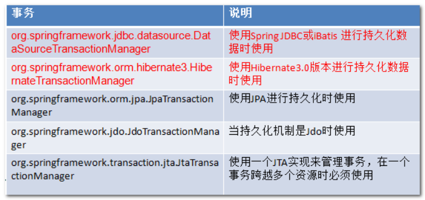
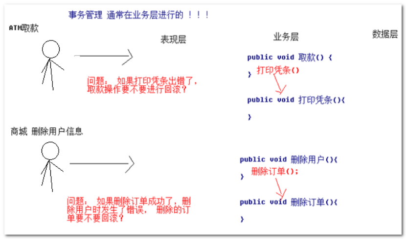
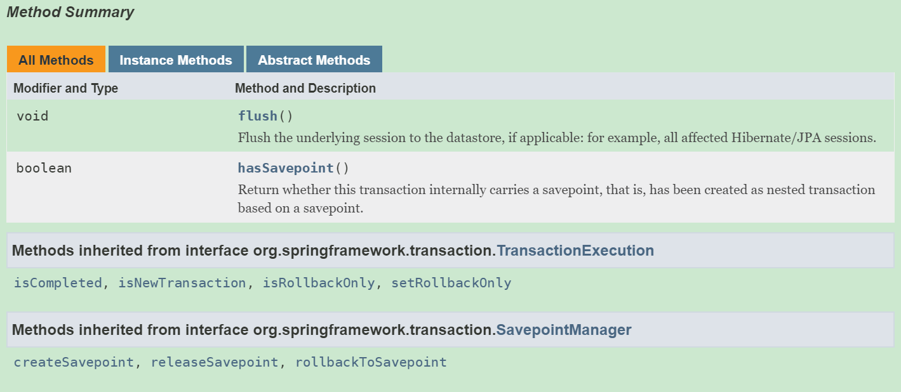

# Spring学习笔记(12)Spring的事务管理

---
[toc]

---

# 事务

- 事务:是逻辑上一组操作， 要么全都成功， 要么全都失败.
- 事务特性:
  ACID:
    - 原子性:事务不可分割
    - 一致性:事务执行的前后， 数据完整性保持一致.
    - 隔离性:一个事务执行的时候， 不应该受到其他事务的打扰
    - 持久性:一旦结束， 数据就永久的保存到数据库.
  
- 如果不考虑隔离性:
    - 脏读:一个事务读到另一个事务未提交数据
    - 不可重复读:一个事务读到另一个事务已经提交数据（ update） 导致一个事务多次查询结果不一致
    - 虚读:一个事务读到另一个事务已经提交数据（ insert） 导致一个事务多次查询结果不一致

- 事务的隔离级别:
未提交读:以上情况都有可能发生。
已提交读:避免脏读， 但不可重复读， 虚读是有可能发生。
可重复读:避免脏读， 不可重复读， 但是虚读有可能发生。
串行的:避免以上所有情况.

# 1.Spring的事务管理机制

Spring事务管理高层抽象主要包括3个接口，Spring的事务主要是由他们共同完成的：
- `PlatformTransactionManager`：事务管理器—主要用于平台相关事务的管理
- `TransactionDefinition`：事务定义信息(隔离、传播、超时、只读)—通过配置如何进行事务管理。
- `TransactionStatus`：事务具体运行状态—事务管理过程中，每个时间点事务的状态信息。

## 1.1.PlatformTransactionManager事务管理器


该接口提供三个方法：
- commit：提交事务
- rollback：回滚事务
- getTransaction：获取事务状态

Spring为不同的持久化框架提供了不同PlatformTransactionManager接口实现：


- `DataSourceTransactionManager`针对`JdbcTemplate`、`MyBatis` 事务控制 ，使用`Connection`（连接）进行事务控制 ：
开启事务 `connection.setAutoCommit(false); `
提交事务 `connection.commit();`
回滚事务 `connection.rollback();`
- `HibernateTransactionManage`针对`Hibernate`框架进行事务管理， 使用`Session`的`Transaction`相关操作进行事务控制 ：
开启事务 `session.beginTransaction();`
提交事务 `session.getTransaction().commit();`
回滚事务 `session.getTransaction().rollback();`

事务管理器的选择？
用户根据选择和使用的持久层技术，来选择对应的事务管理器。

## 1.2.TransactionDefinition事务定义信息


该接口主要提供的方法：
- `getIsolationLevel`：隔离级别获取
- `getPropagationBehavio`r：传播行为获取
- `getTimeout`：获取超时时间
- `isReadOnly` 是否只读(保存、更新、删除—对数据进行操作-变成可读写的，查询-设置这个属性为true，只能读不能写)
- `withDefaults()`
  ```
    Return an unmodifiable TransactionDefinition with defaults.
    For customization purposes, use the modifiable DefaultTransactionDefinition instead.

    Since:
    5.2
  ```
这些事务的定义信息，都可以在配置文件中配置和定制。

### 1.2.1.IsolationLevel事务的隔离级别


事务四大特性 ACID ---隔离性引发问题 ---- 解决事务的隔离问题 隔离级别 
Mysql 默认隔离级别 REPEATABLE_READ
Oracle 默认隔离级别 READ_COMMITTED

### 1.2.2.事务的传播行为PropagationBehavior

什么是事务的传播行为？ 有什么作用？ 
事务传播行为用于解决两个被事务管理的方法互相调用问题

表现层：责任是管理页面跳转，页面数据获取和传递
业务层：管理逻辑、封装数据 --- 一个方法可能会调用多个dao，放在一个事务中，只要有一次操作失败，整体回滚，保证业务的完整性。
持久层：主要是和数据库打交道


业务层两个方法面临的事务问题：有些时候需要处于同一个事务，有些时候不能在同一个事务 ！

事务的传播行为的7种类型：


主要分为三大类：

- `PROPAGATION_REQUIRED(默认值)`、`PROPAGATION_SUPPORTS`、`PROPAGATION_MANDATORY`
支持当前事务， A调用B，如果A事务存在，A和B处于同一个事务 。
事务默认传播行为 REQUIRED。

- `PROPAGATION_REQUIRES_NEW`、`PROPAGATION_NOT_SUPPORTED`、`PROPAGATION_NEVER` 
不会支持原来的事务 ，A调用B， 如果A事务存在， B肯定不会和A处于同一个事务。
常用的事务传播行为：PROPAGATION_REQUIRES_NEW

- `PROPAGATION_NESTED`
嵌套事务 ，只对DataSourceTransactionManager有效 ，底层使用JDBC的SavePoint机制，允许在同一个事务设置保存点，回滚保存点

嵌套事务的示例：
```java
Connection conn=null; 
try{
    conn. setAutoCommit(false); 
    Statement stmt=conn.createStatement(); 
    stmt.executeUpdate("update person set name='888' where id=1");
    Savepoint savepoint=conn.setSavepoint(); 
try{
    conn.createStatement().executelypdate("update person set name=222'where sid=2");
} catch(Exception ex){
    conn.rollback(savepoint); 
}
stmt.executeUpdate("delete from person where id=9"); 
conn.commit();
stmt.close();
} catch(Exception e){
    conn.rollback();
} finally{
    try{
        if(null!=conn && lconn. isClosed0) conn.close();
} catch (SQLException e){e. printstackTrace()}
```

[面试题] REQUIRED、REQUIRES_NEW、NESTED 区分 
    REQUIRED 一个事务
    REQUIRES_NEW 两个事务 
    NESTED 一个事务，事务可以设置保存点，回滚到保存点 ，选择提交或者回滚

## 1.3.TransactionStatus 事务状态



Oracle事务的结束：
1．手动commit
2．正常关闭或者create table等DDL语言—自动提交—commit
3．死机断电----自动回滚，然后自动提交。
事务的结束必须通过commit ,rollback 作用标记为回滚。
```java
	try {
		操作
	} catch (){
		rollback
	} finally {
		commit 
}
```

【三个事务超级接口对象之间的关系】 
用户管理事务，需要先配置事务管理方案`TransactionDefinition`、 
管理事务通过`TransactionManager `完成，`TransactionManager`根据 `TransactionDefinition`进行事务管理，在事务运行过程中，每个时间点都可以通过获取`TransactionStatus`了解事务运行状态！ 

## 1.4.Spring事务管理两种方式

- 编程式的事务管理
通过TransactionTemplate手动管理事务
在实际应用中很少使用，原因是要修改原来的代码，加入事务管理代码（侵入性 ）

- 使用XML配置声明式事务
Spring的声明式事务是通过AOP实现的（环绕通知）
开发中经常使用（代码侵入性最小）--推荐使用！

# 2.声明式事务管理案例-转账（xml、注解）


## 2.1.实体类
- Account
```java
public class Account {
    public int id;
    public String name;
    public float money;

    public int getId() {
        return id;
    }

    public void setId(int id) {
        this.id = id;
    }

    public String getName() {
        return name;
    }

    public void setName(String name) {
        this.name = name;
    }

    public float getMoney() {
        return money;
    }

    public void setMoney(float money) {
        this.money = money;
    }

    @Override
    public String toString() {
        return "Account{" +
                "id=" + id +
                ", name='" + name + '\'' +
                ", money=" + money +
                '}';
    }
}
```

## 2.2.编写dao和service

### 2.2.1.编写dao

- IAccountDao
```java
public interface IAccountDao {
    /**
     * 转出的方法
     * @param from :转出的人
     * @param money :要转账金额
     */
    void out(String from,Double money);
    /**
     * 转入的方法
     * @param to :转入的人
     * @param money :要转账金额
     */
    void in(String to,Double money);
}
```

- AccountDaoImpl
```java
public class AccountDaoImpl extends JdbcDaoSupport implements IAccountDao {
    /**
     * 转出的方法
     *
     * @param from  :转出的人
     * @param money :要转账金额
     */
    @Override
    public void out(String from, Double money) {
        String sql="update account set money=money-? where name=?";
        super.getJdbcTemplate().update(sql,money,from);
    }

    /**
     * 转入的方法
     *
     * @param to    :转入的人
     * @param money :要转账金额
     */
    @Override
    public void in(String to, Double money) {
        String sql="update account set money=money+? where name=?";
        super.getJdbcTemplate().update(sql,money,to);
    }
}
```

### 2.2.2.编写service

- IAccountService
```java
public interface IAccountService {
    /**
     * 转账的方法
     * @param from:从哪转出
     * @param to:转入的人
     * @param money:转账金额
     */
    void transfer(String from,String to,Double money);
}
```

- AccountServiceImpl
```java
public class AccountServiceImpl implements IAccountService {
    private TransactionTemplate transactionTemplate;

    /**
     * 为了注入transactionTemplate
     * @param transactionTemplate
     */
    public void setTransactionTemplate(TransactionTemplate transactionTemplate) {
        this.transactionTemplate = transactionTemplate;
    }

    private AccountDaoImpl accountDao;

    /**
     * 为了注入dao
     * @param accountDao
     */
    public void setAccountDao(AccountDaoImpl accountDao) {
        this.accountDao = accountDao;
    }

    /**
     * 转账的方法
     *
     * @param from  :转出的人
     * @param to    :转入的人
     * @param money :转账金额
     */
    @Override
    public void transfer(String from, String to, Double money) {
        // 从A转入B,A的数量减少
        accountDao.out(from,money);
        // int i=1/0;
        // B转入,B的数量增加
        accountDao.in(to, money);
    }
}
```
## 2.3.配置步骤

### 2.3.1.第一步:配置事务管理器并注入数据源

```xml
 <!--配置事务管理器-->
    <bean id="transactionManager" class="org.springframework.jdbc.datasource.DataSourceTransactionManager">
        <!--注入数据源-->
        <property name="dataSource" ref="dataSource"/>
    </bean>
```
### 2.3.2.第二步:配置事务模板类

```xml
<!--事务管理的模板-->
    <bean id="transactionTemplate" class="org.springframework.transaction.support.TransactionTemplate">
        <!--name必须这样:因为要注入-->
        <property name="transactionManager" ref="transactionManager"/>
    </bean>
```

### 2.3.3.第三步:在业务层注入模板类:(模板类管理事务)

```xml
<!--配置业务层-->
<bean id="accountService" class="club.krislin.dao.impl.AccountServiceImpl">
    <!--service 依赖 dao 层 -->
    <property name="accountDao" ref="accountDao"/>
    <!--在业务层注入事务的管理模板-->
    <property name="transactionTemplate" ref="transactionTemplate"/>
</bean>
```

### 2.3.4.第四步:在业务层代码上使用模板

```java
/**
    * 转账的方法
    *
    * @param from  :转出的人
    * @param to    :转入的人
    * @param money :转账金额
    */
@Override
public void transfer(String from, String to, Double money) {
    transactionTemplate.execute(new TransactionCallbackWithoutResult() {
        @Override
        protected void doInTransactionWithoutResult(TransactionStatus transactionStatus) {
            // 从A转入B,A的数量减少
            accountDao.out(from,money);
            int i=1/0;
            // B转入,B的数量增加
            accountDao.in(to, money);
        }
    });
}
```