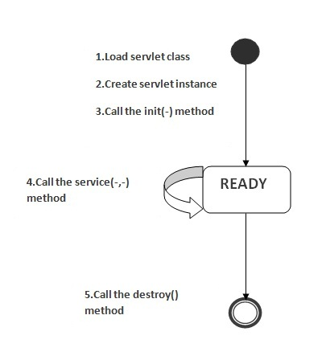
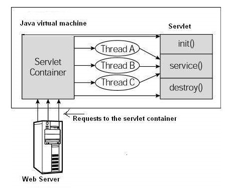

Web容器维护servlet实例的生命周期。下面来看看servlet的生命周期，主要分为以下几个步骤：
1. 加载Servlet类，如：MyServlet.java。
2. 创建Servlet实例。
3. 调用Servlet类的init方法。
4. 调用Servlet类的service方法。
5. 调用Servlet类的destroy方法。
   
模型流程图如下所示 

如上图所示，`servlet`有三种状态：新，就绪和结束。 如果`servlet`实例被创建，则`servlet`处于新状态。 调用`init()`方法后，`Servlet`进入就绪状态。 在就绪状态下，`servlet`执行所有任务。当web容器调用`destroy()`方法时，它转移到结束状态。

**1. 加载Servlet类**
类加载器负责加载servlet类。 当Web容器接收到servlet的第一个请求时，将加载servlet类。
**2. 创建Servlet实例**
Web容器在加载servlet类之后创建一个servlet的实例。servlet实例在servlet生命周期中只创建一次。
**3. 调用init方法**
Web容器在创建servlet实例后调用`init`方法一次。 `init`方法用于初始化servlet。 它是`javax.servlet.Servle`t接口的生命周期方法。init方法的语法如下：
~~~java
public void init(ServletConfig config) throws ServletException
~~~
Java
**4. 调用service方法**
每当接收到servlet的请求时，Web容器都会调用`service`方法。如果servlet未初始化，则遵循上述前三个步骤，然后调用`service`方法。 如果servlet被初始化，它调用`service`方法。 请注意，servlet仅初始化一次。 Servlet接口的`service`方法的语法如下：
~~~java
public void service(ServletRequest request, ServletResponse response)   throws ServletException, IOException
~~~
Java
**5. 调用destroy方法**
从服务中删除servlet实例之前，Web容器调用`destroy`方法。它使servlet有机会清理所有资源，例如内存，线程等。Servlet接口的`destroy`方法的语法如下：
~~~java
public void destroy()
~~~

## 架构图
下图描述了一个典型的servlet生命周期场景。

* 首先将来到服务器的HTTP请求委托给servlet容器。
* servlet容器在调用service()方法之前加载servlet。
* 然后，servlet容器通过产生多个线程来处理多个请求，每个线程执行servlet的单个实例的service()方法。
