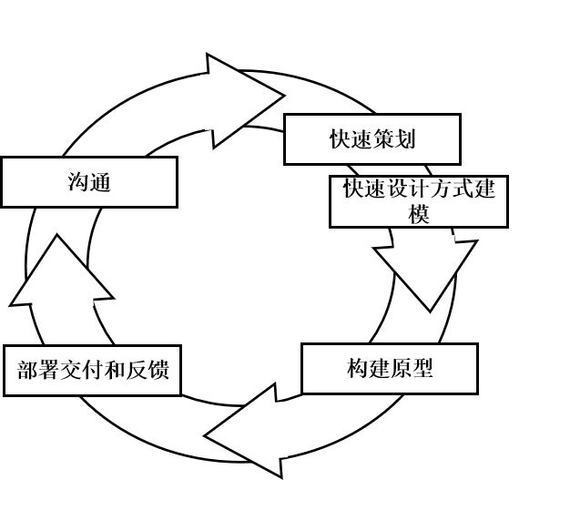

# 软件工程

# 1.试卷上的知识点

适合于面向对象方法学的软件生存周期模型是 **喷泉模型**

从结构化的瀑布模型看，在它的生命周期中的八个阶段中，下面的几个选项中哪个环节出错，对软件的影响最大的是 **需求分析阶段**

**原型化方法** 对软件设计和开发人员的开发要求最高

结构化分析方法是一个预先严格定义需求的方法，它在实施时强调的是分
析对象的 **数据流**

软件开发的结构化生命周期方法将软件生命周期划分成 

- **计划阶段**
- **开发阶段**
- **运行阶段**

从实用角度看，数据规范化在大多数场合选用 **第3范式**。

模块的内聚性最高的是 **功能内聚**

**软件危机**:开发软件所需高成本和产品的低质量之间有着尖锐的矛盾

需求分析阶段的任务是确定 **软件系统的功能**

完整的软件结构通常用 **HIPO图** 来表示

再白盒测试中 **语句** 是最弱的覆盖标准

单元测试一般以***白盒测试为主,以黑盒测试为辅***

软件开发中长采用的结构化生命周期方法 ,由于其特征一般被称为 **瀑布模型**

**3大类软件概要设计方法**

- 以数据流图为基础构造模块结构的 ***结构化设计方法***
- 以数据结构为基础构造模块的 ***Jackson方法***
- 以对象 类 继承和通信为基础的 ***面向对象的设计方法***

***数据流图*** 和 ***数据字典*** 共同构成系统的逻辑模型

模块内的高内聚往往意味着模块间的松耦合

判定覆盖不一定包含条件覆盖,条件覆盖也不一定包含判定覆盖

在程序调试时,找出错误的位置和性质比改正错误更难

快速原型模型可以有效地适应用户需求的动态变化

模块化,信息隐藏,抽象和逐步求精的软件设计原则有助于得到高内聚,低耦合度的软件产品

# 2.课件

# 软件过程

软件工程是

1. 把系统化的,规范化的,可度量的途径应用于软件开发,运行和维护的过程,也就是把工程化应用于软件中
2. 研究1中提到的途径

软件是一种层次化的技术

​		从上到下依次是

- 工具
- 方法
- 过程
- 质量关注点

典型的普适性活动

- 软件项目跟踪和控制
- 风险管理
- 软件质量保证
- 正式的技术复审
- 测量
- 软件配置管理
- 可复用管理
- 工作产品的准备和产生

## 软件过程模型

瀑布模型   演化模型	统一过程模型

### 瀑布模型

### 演化过程模型

​		原型开发	螺旋模型

#### 原型开发

原型的类型

- 探索型
- 探索型
- 探索型

原型的使用策略

- 废弃策略：主要用于探索型和实验型原型的开发。
- 追加策略：主要用于演化型原型的开发。

*** 原型可作为单独的过程模型使用，它也常被作为一种方法或实现技术应用于其它的过程模型中。***

#### 螺旋模型

螺旋模型是一种演进式软件过程模型。

- 结合了原型的迭代性质和瀑布模型的系统性和可控性特点。
- 具有快速开发越来越完善软件版本的潜力。

### 统一过程模型

- 用力驱动
- 以体系架构为核心
- 迭代并且递增

# 软件工程实践

David Hooker提出7个关注软件工程整体实践的核心原则。

- 第1原则:存在价值
  第2原则:保持简洁
  第3原则:维护视图
  第4原则:生产者要让消费者理解
  第5原则:面向未来
  第6原则:计划复用
  第7原则:认真思考

## 沟通实践

### 沟通原则

- 原则#1：倾听
- 原则#2：有准备的沟通
- 原则#3：需要有人推动
- 原则#4：最好当面沟通
- 原则#5：记录所有决定
- 原则#6：保持通力协作
- 原则#7：聚焦并协调话题
- 原则#8：采用图形表示
- 原则#9：继续前进原则
- 原则#10：谈判双赢原则

### 沟通活动通用任务集

- 1.识别主要客户和其他共利益者
- 2.与主要客户会谈“环境无关的问题” ，确定：
  - 业务需要和商业价值
  - 最终用户的特性需要
  - 需要的用户可见输出
  - 业务约束
- 3.写一页项目范围（范围往往会修订）的说明
- 4.评审范围说明，并应客户要求做出相应修改
- 5.与客户/最终用户进行协作，确定以下内容：
  - 采用标准格式记录客户可见的使用场景
  - 输入和输出
  - 重要的软件特性、功能和行为
  - 客户定义的商业风险
- 6.简要书面描述(例如一些列表)场景、输出/输入、特性/功能以及风险。
- 7.与客户反复交换意见以细化场景、输出/输入、特性/功能以及风险
- 8.为每个用户场景、特性、功能和行为分配客户定义的优先级
- 9.回顾在与客户和其他共利益者交流时搜集的所有信息、并且按照要求修订
- 10.为计划活动做准备

## 策划实践

### 策划原则

- 原则#1：理解项目范围
  原则#2：客户参与策划
  原则#3：采用迭代计划
  原则#4：基于已知估计
  原则#5：计划考虑风险
- 原则#6：保持脚踏实地
  原则#7：调整计划粒度
  原则#8：制定计划确保质量
  原则#9：描述如何适应变化
  原则#10：经常跟踪、校正计划。

### 策划活动通用任务集

- 再评估项目范围
- 评估风险
- 确定和细化用户场景
- 从用户场景中抽象出功能与特征
- 确定实现软件基本要求的技术功能与特征
- 按照用户优先级对用户特有的功能与特征（场景）分组
- 制定一个粗粒度的项目计划
  - 确定预计的软件增量个数
  - 确定整个项目的进度
  - 为每一个增量确定预订的交付时间
- 为当前的迭代制定细粒度项目计划
  - 为每个功能特征制定工作任务
    - 对每个工作任务分派责任
    - 确定要开发的工作产品
    - 确定要使用的质量保证方法
           		- 描述处理变更的方法
- 定期追踪进度
  - 注意可能出现的问题(例如，进度延误)
- 按需调整进度

## 建模实践

### 分析建模实践

#### 分析建模的原则

- 原则#1：必须描述并理解问题的信息域
  原则#2：必须确定软件所要实现的功能
  原则#3：必须描述软件的行为（作为外部事件的结果）。
  原则# 4：描述信息、功能和行为的模型必须以一种能揭示分层（或者分级）细节的方式分解开来。
  原则# 5：分析任务应该从本质信息转向实现细节。

#### 通用分析建模任务集

- 评审业务需求、最终用户特征/要求、用户可见输出、业务约束以及其他一些在客户沟通和策划活动中需要确定的技术需求。

- 扩展和细化用户场景
  	
  	

  - 定义所有的角色。

- 表达角色如何与系统交互。

- 从用户场景中抽象出功能和特征

- 评审用户场景的完备性和准确性

- 信息域建模

  - 描述所有主要信息对象
    定义每个信息对象的属性
    表达信息对象之间的关系

- 功能域建模

  - 表达出功能如何修改数据对象
    细化功能以提供细节
    书写叙述性的过程来描述每个功能和子功能
    评审功能模型

- 行为域建模

  - 确定引起系统行为变化的外部事件
    确定表明每个外部可见行为模型的状态
    描述事件如何引起系统的状态转换
    评审行为模型

- 用户接口分析和建模

  - 实施任务分析。
    创建屏幕视图原型。

- 评审所有模型，考虑完备性、一致性

  

### 设计建模实践

#### 设计建模原则

- 原则#1：设计可追溯到分析模模型
  原则#2：经常关注待建系统的架构
  原则#3：数据设计与功能设计同等重要
  原则#4：必须设计接口(包括内部接口和外部接口)
  原则#5：用户界面设计必须符合最终用户要求
- 原则#6：功能独立的构件级设计
  原则#7：构件之间以及构件与外部环境之间松散藕合。
  原则#8 ：设计表述(模型)应该做到尽可能易于理解。
  原则#9 ：设计应该迭代式进行。每次迭代，设计者都应该尽力简化。

#### 通用设计任务集

- 使用分析模型，选择适合软件的架构风格（模式）
- 把分析模型划分成若干设计子系统，并按照架构分配到各个子系统中
  确定每个子系统都是功能耦合的。
  设计子系统接口。
  把分析的类或功能分配到各个子系统中。
  使用信息域模型，设计合适的数据结构。
- 设计用户界面
  评审任务分析结果。
  确定基于用户场景的活动顺序。
  创建界面行为模型。
  定义界面对象和控制机制。
  评审界面设计并进行必要的修正。
- 进行构件级设计
  在较低层抽象级上确定所有的算法。
  精化每个构件的接口。
  定义构件级的数据结构。
  评审构件级设计。
- 开发部署模型

## 构造实践

### 编码

#### 编码原则

- 准备原则
  编码原则
  确认原则

#### 通用构造任务集

- 构建基本架构
  评审架构设计。
  编码并测试构件以实现基本架构。
  获得可复用的架构模式。
  测试基本构架以确保接口完整性。
- 构建软件构件
  评审构件级设计。
  对构件进行编码和单元测试。
  对构件数据结构和接口进行编码。
  对内部算法和相关处理功能进行编码。
  在编码完成时评审代码。
  检查正确性。
  确保遵循编码标准。
  确保编码有注释。
- 构件单元测试。
  进行所有的单元测试。
  纠正所发现的错误。
  重复单元测试。
- 将已经完成的构件集成到基本构架中

### 测试

#### 测试原则

- 所有的测试都应该可以迫溯到用户需求。
- 测试计划应该远在测试开始前就开始着手。
- 将pareto原则(2/8法则）应用于软件测试。
- 测试应从“微观”开始，逐步转向“宏观”。
- 穷举测试是不可能的。

#### 通用测试任务集

- 为每个软件构件模块设计单元测试
  - 查看每个单元测试以确保完全覆盖。
    执行单元测试。
    改正发现的错误。
    再次执行单元测试。
- 制定一个集成策略
  - 确定执行集成策略的顺序。
    定义“构建”以及检验这些构件所需要的测试。
    每天进行“冒烟”测试。
    必要时进行回归测试。
- 制定确认策略
  - 确定确认准则。
    定义确认软件的测试。
- 执行集成测试和确认测试
  - 改正发现的错误。
    必要时重复进行测试。
- 执行高层次测试
  - 进行恢复性测试
    进行安全测试
    进行压力测试
    进行性能测试
- 与客户进行验收测试

## 部署实践

### 部署原则

- 客户对于软件的期望必须得到管理。
- 完整的交付包应该经过安装和测试。
- 技术支持必须在软件交付之前就确定下来。
- 必须为最终用户提供适当的说明材料。
- 有缺陷的软件应该先改正再交付。

### 通用部署任务集

- 创建交付介质
- 确定支持人员或团队
- 确立用户反馈机制
- 向用户公布要交付的介质
- 建立不断发展的支持功能。
- 收集用户反馈。

# 需求工程
 - 起始
 - 导出
 - 精化
 - 协商
 - 规格说明
 - 确认
 - 管理
 ## 面对对象分析
 1. 在客户端可开发者必须对基本需求进行交流
 2. 确定类
 3. 定义类的层次结构
 4. 表现对象与对象的关系
 5. 为对象行为建模
 6. 上述1~5的工作步骤重复迭代直至模型完成
 